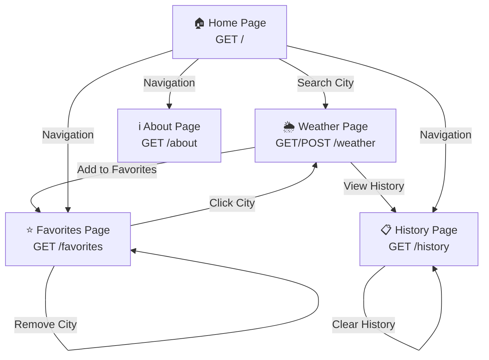

# 🌦️ WeatherNow - Real-Time Weather Forecast Application

WeatherNow is a modern, responsive **Full-Stack Weather Forecasting Web Application** built with **Python and Flask**, powered by the **OpenWeatherMap API**. 

It provides real-time weather analytics, 5-day forecasts, a user search history, a personalized favorite cities dashboard, and an interactive glassmorphic UI/UX.

---

# 🚀 Features

## 🌦️ Weather Analytics & Forecasts
- **Real-Time Data:** View current temperature, feels-like temperature, humidity, wind speed, atmospheric pressure, visibility, and cloud cover.
- **5-Day Outlook:** Get daily temperature highs, lows, and general weather conditions grouped cleanly by day.
- **Dynamic Icons:** Renders visual weather state illustrations based on API conditions.

## 💾 User Session & History Management
- **Search History:** Automatically log and display the last 10 search queries with precise timestamps.
- **History Control:** Clear search history with a single click.
- **Favorite Cities:** Save/remove locations to a personal favorites list for instant access.

## 🎨 Premium UI/UX Design
- **Glassmorphism:** Elegant, semi-transparent panels with modern CSS drop-shadows.
- **Dark Mode Support:** Smooth, eye-friendly theme toggle.
- **Responsive Layout:** Optimized for mobile, tablet, and desktop viewports.
- **Micro-animations:** Hover transitions and interactive elements for a premium feel.

## 🛡️ Robust Security & Error Handling
- **Graceful Failures:** Dedicated, styled `404` and `500` error pages.
- **API Resilience:** Handles empty API keys, invalid city names, network timeouts, and rate-limiting exceptions without crashing.
- **Cryptographic Security:** Session-based flash notifications secured using a customizable `SECRET_KEY`.

---

# 🛠️ Technology Stack

| Category | Technology | Description |
|---|---|---|
| **Backend** | Python 3.11+, Flask | Routing, Jinja2 template rendering, controller logic |
| **Database** | SQLite, Flask-SQLAlchemy | Local persistence for search history and favorite cities |
| **API Integration** | OpenWeatherMap API, Requests | External HTTP client fetching real-time weather and forecast data |
| **Frontend** | HTML5, CSS3, JavaScript (Vanilla) | Custom styling, local interactivity, dark-mode toggle |
| **Styling Framework**| Bootstrap 5 | Layout scaffolding and responsive grid structure |
| **Deployment** | Gunicorn | Production-ready WSGI server configuration |

---

# 📂 Project Structure

```text
Weather App/
│
├── app.py                  # Main Flask application & routes controller
├── config.py               # Application configurations (Database, API Keys, Secrets)
├── database.py             # SQLAlchemy instance initialization
├── models.py               # SQLite database schemas (SearchHistory, FavoriteCities)
├── weather_service.py      # HTTP client service wrapper for OpenWeatherMap API
├── requirements.txt        # Python dependency manifest
├── .env.example            # Reference environment variables template
├── README.md               # Detailed system documentation
│
├── static/                 # Frontend assets
│   ├── css/
│   │   └── style.css       # Custom CSS styling (Glassmorphism design tokens)
│   └── js/
│       └── script.js       # Dark mode logic and input validation
│
└── templates/              # Jinja2 HTML templates
    ├── base.html           # Universal structure, navbar, and flash messages
    ├── index.html          # Landing page with central search bar
    ├── weather.html        # Main weather dashboard and forecast card views
    ├── history.html        # Table of recent searches
    ├── favorites.html      # Saved cities grid layout
    ├── about.html          # Project information and technical stack overview
    ├── error.html          # Generic 500 error display
    └── 404.html            # Not Found error display
```

---

# ⚙️ Installation & Setup

## 1. Clone the Repository
```bash
git clone <repository-url>
cd "Weather App"
```

## 2. Configure Virtual Environment

**Windows:**
```cmd
python -m venv venv
venv\Scripts\activate
```

**macOS / Linux:**
```bash
python3 -m venv venv
source venv/bin/activate
```

## 3. Install Dependencies
```bash
pip install -r requirements.txt
```

---

# 🔑 Configuration Guide & API Setup

## 1. Obtain an OpenWeatherMap API Key
- Register a free account at [OpenWeatherMap API](https://openweathermap.org/api).
- Navigate to your dashboard and generate an **API Key** (AppID).

## 2. Define Environment Variables
Create a local `.env` configuration file from the provided template:
```bash
cp .env.example .env
```
Open `.env` and fill in your keys:
```env
OPENWEATHER_API_KEY=your_actual_api_key_here
SECRET_KEY=generate_a_random_secret_string
DATABASE_URI=sqlite:///weather.db
```

---

# 🏗️ Application Architecture

## 🔄 Request Flow & Navigation Map



---

## 🛰️ API Integration & Database Flow

**Request Sequence:**
1. User searches for a city on the weather page
2. Flask route captures the city name from POST request
3. City is logged to SearchHistory table in SQLite database
4. WeatherService class makes HTTP GET request to OpenWeatherMap API
5. API returns real-time weather data and 5-day forecast
6. Weather data is processed and rendered in weather.html template
7. User can add/remove cities from favorites (stored in FavoriteCities table)

**Error Handling Flow:**
- Invalid city name → Display flash error message
- API timeout → Return graceful timeout error
- Rate limit exceeded → Notify user to try again later
- Missing API key → Alert developer to configure environment

---

## 🗄️ Database Schema

**SearchHistory Table:**
- `id` (Integer, Primary Key)
- `city` (String, Required)
- `searched_at` (DateTime, Auto-timestamp)

**FavoriteCities Table:**
- `id` (Integer, Primary Key)
- `city` (String, Unique, Required)
- `added_at` (DateTime, Auto-timestamp)

---

# 🧪 Testing Instructions

## 1. Run the Flask Server
```bash
python app.py
```
By default, the application runs on **[http://127.0.0.1:5000](http://127.0.0.1:5000)**. 
*(If port 5000 is occupied, you can launch on a different port using `flask run --port 8000 --debug`)*

## 2. Quality Assurance Checklist
- [ ] **API Verification:** Search for a valid city (e.g., `New York`) and confirm data, temperature, and 5-day forecast load successfully.
- [ ] **Error Resilience:** Input an invalid city name (e.g., `InvalidCityName123`) and verify that a styled flash error is outputted gracefully without application exceptions.
- [ ] **Persistence:** Add the city to favorites, navigate to the `/favorites` route, and verify it is persistent.
- [ ] **Search Log:** Navigate to `/history` and verify that recent search queries show up chronologically with accurate timestamps.
- [ ] **Interactive Styling:** Click the dark mode toggle switch and ensure CSS glassmorphic variables re-render correctly.
- [ ] **Responsive Design:** Test on mobile, tablet, and desktop viewports to ensure proper layout.
- [ ] **Error Pages:** Manually trigger 404 and 500 errors to verify styled error pages display.

---

# 🚀 Future Enhancements

- **Client-Side Geolocation:** Request browser permission to automatically load the user's local weather upon landing.
- **Interactive Weather Maps:** Embed Leaflet.js or OpenWeatherMap layers to display wind, temperature, and precipitation maps.
- **Metric/Imperial Toggle:** Allow users to toggle between Celsius (°C) and Fahrenheit (°F) dynamically.
- **Weather Alerts:** Push notification integrations for extreme weather warnings based on selected favorite cities.
- **Dockerization:** Add a `Dockerfile` and `docker-compose.yml` for unified development and production builds.
- **Unit Tests:** Add pytest test suite for backend route and service testing.
- **API Caching:** Implement Redis caching to reduce API calls and improve performance.

---

# 🤝 Contribution

1. Fork the repository
2. Create your feature branch (`git checkout -b feature/AmazingFeature`)
3. Commit your changes (`git commit -m 'Add some AmazingFeature'`)
4. Push to the branch (`git push origin feature/AmazingFeature`)
5. Open a Pull Request

---

# 👨‍💻 Author

**Krushil Lukhi**  
*Python Developer | Flask Developer | Full-Stack Engineer*

**LinkedIn:** [Your LinkedIn Profile]  
**GitHub:** [Your GitHub Profile]

---

*This project is built as a portfolio piece and showcase for modern full-stack Python development with Flask and OpenWeatherMap API integration.*
